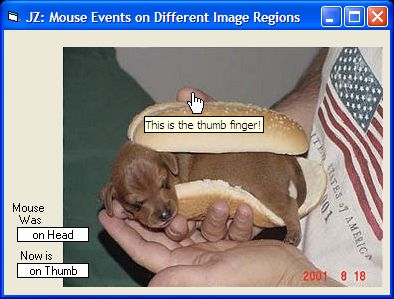



## JZ Pixies \(Project Case\)

### Description

Transparent Mouse Events: On, Out, Move, Leave, Click, DblClick and+ on different regions inside any Image/Photo/etc in very simple code: no APIs, no DLLs, no .Bas - only in Form1 design and easy normal procedures. See Doc at Form.
 
### More Info
 

             |
---                |---
**Submitted On**   |2005-05-23 19:37:18
**By**             |[JOZE Walter Moura](https://github.com/Planet-Source-Code/PSCIndex/blob/master/ByAuthor/joze-walter-moura.md)
**Level**          |Beginner
**User Rating**    |5.0 (10 globes from 2 users)
**Compatibility**  |VB 5\.0, VB 6\.0
**Category**       |[Coding Standards](https://github.com/Planet-Source-Code/PSCIndex/blob/master/ByCategory/coding-standards__1-43.md)
**World**          |[Visual Basic](https://github.com/Planet-Source-Code/PSCIndex/blob/master/ByWorld/visual-basic.md)
**Archive File**   |[JZ\_Pixies\_1891405232005\.zip](https://github.com/Planet-Source-Code/joze-walter-moura-jz-pixies-project-case__1-60649/archive/master.zip)

